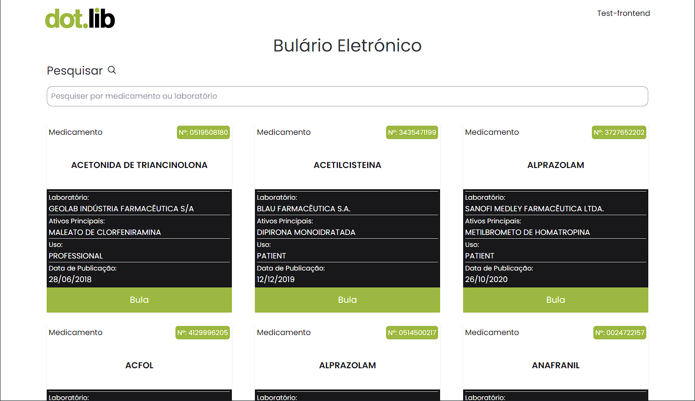
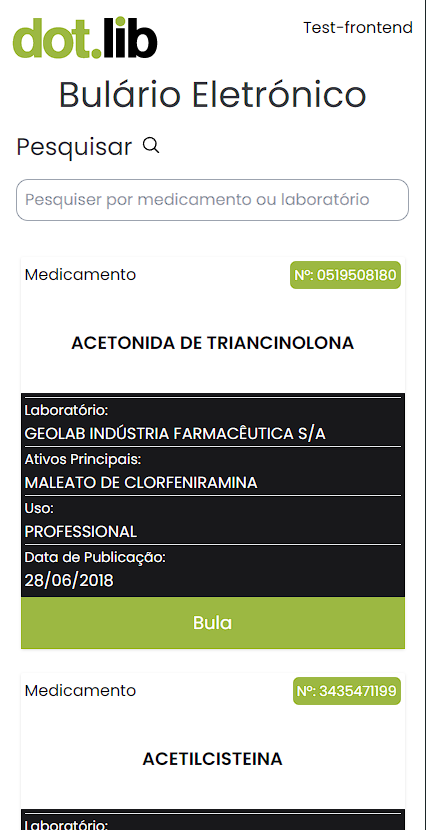

# Sobre

<h1 aling="center">Dotlib Test Front end</h1

<p>Test técnico para vaga de front-end jr</p>
<p>A tarefa é desenvolver uma aplicação em React para um Guia de Bulário Eletrônico, que se conecta a uma FakeAPI utilizando o json-server, com o objetivo de exibir uma lista e permitir consultas sobre bulas de medicamentos.</p>

<p>
A aplicação possuir uma consulta por nome do medicamento ou laboratório farmacêutico e apresentar os resultados em uma listagem </br>
É ordenado por data de publicação do medicamento </br>
Possuir uma paginação de dez em dez itens para cada página </br>
E foi lido por meio de uma api REST disponibilizada</p>

# Desktop

<p aling="center">
    
  
</p>

# Mobile

<p aling="center">
  
</p>

## 🧪 Technologies

Este Projeto foi desenvolvido usando seguintes tecnolias:

- [ReactJS](https://reactjs.org)
- [Vite](https://vitejs.dev/)
- [Tailwind Css](https://tailwindcss.com)
- [phosphor icon](https://phosphoricons.com/)
- [date-fns](https://date-fns.org/)

## 🚀 Getting started

Clone o projeto pare ter acessos dos arquivos.

```bash
git clone

cd dotlib-test-front
```

Run this command to install the dependencies.

```bash
npm install

npm run dev

npm run backend
```

## 🔖 Layout

Você pode visualiza os projetos pelos links abaixo:

- [Live Preview]()
